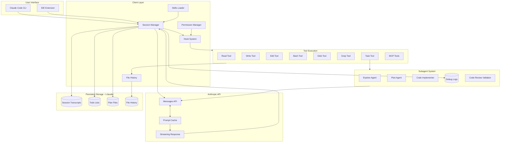
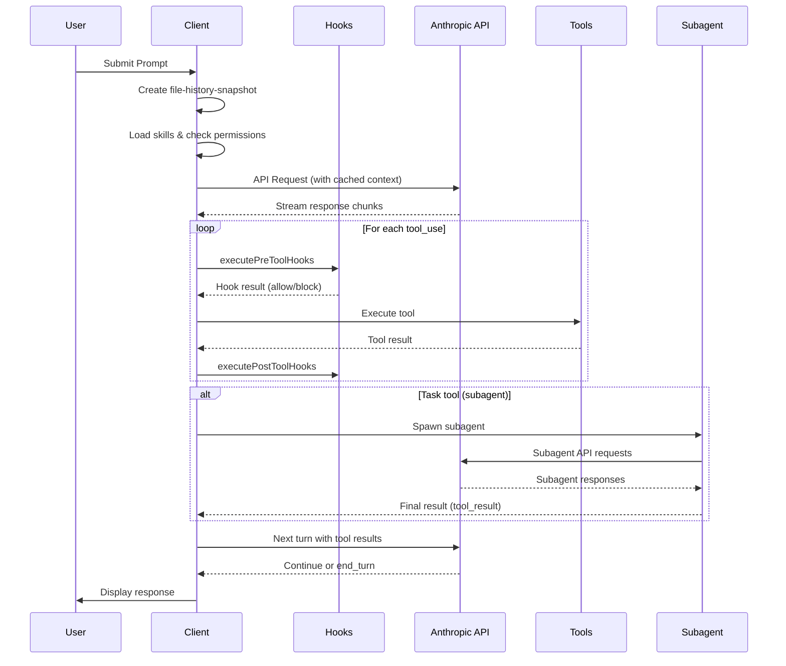
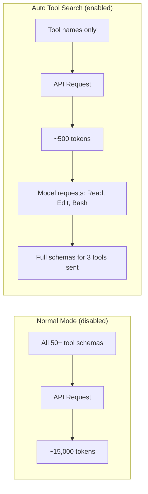

# Claude Code CLI Architecture Analysis

Analysis of Claude Code v2.1.12 based on examination of session logs, debug output, and transcript files.

---

## Architecture Overview



---

## Message Flow Sequence



---

## 1. Log Locations & File Structure

### Primary Storage: `~/.claude/`

```
~/.claude/
├── debug/                    # Real-time debug logs per session
│   └── <session-id>.txt      # Timestamped debug output
├── projects/                 # Per-project session transcripts
│   └── -Users-...-projectname/
│       ├── <session-id>.jsonl        # Full conversation transcript
│       └── <session-id>/
│           ├── subagents/            # Subagent transcripts
│           │   └── agent-<id>.jsonl
│           └── tool-results/         # Large tool outputs
│               └── toolu_<id>.txt
├── history.jsonl             # User prompt history (all sessions)
├── todos/                    # Active task lists
│   └── <session-id>-agent-<agent-id>.json
├── plans/                    # Plan mode files
├── file-history/             # File version snapshots for undo
├── session-env/              # Per-session environment state
├── shell-snapshots/          # Shell state persistence
└── settings.json             # User preferences
```

---

## 2. Message Flow Architecture

### 2.1 JSONL Transcript Structure

Each line in a `.jsonl` transcript is a self-contained JSON object. Message types:

| Type | Description |
|------|-------------|
| `user` | Human messages or tool results |
| `assistant` | Claude responses with tool calls |
| `summary` | Context compression markers |
| `system` | Metadata (turn duration, etc.) |
| `progress` | Subagent progress updates |
| `file-history-snapshot` | File state for undo/rollback |

### 2.2 User Message Structure

```json
{
  "type": "user",
  "message": {
    "role": "user",
    "content": "User's prompt text here"
  },
  "uuid": "3ce52132-...",
  "parentUuid": null,
  "sessionId": "5d5bfbde-...",
  "cwd": "/path/to/project",
  "gitBranch": "main",
  "version": "2.1.12",
  "timestamp": "2026-01-20T15:03:27.256Z",
  "thinkingMetadata": {
    "level": "high",      // "high" | "medium" | "low" | "none"
    "disabled": false,
    "triggers": []
  },
  "todos": []
}
```

### 2.3 Assistant Response Structure

```json
{
  "type": "assistant",
  "message": {
    "model": "claude-opus-4-6",
    "id": "msg_01...",
    "role": "assistant",
    "content": [
      {
        "type": "thinking",
        "thinking": "Internal reasoning...",
        "signature": "EscFCk..."  // Verification signature
      },
      {
        "type": "text",
        "text": "Response to user..."
      },
      {
        "type": "tool_use",
        "id": "toolu_01...",
        "name": "Bash",
        "input": {
          "command": "ls -la",
          "description": "List files"
        }
      }
    ],
    "stop_reason": "tool_use",  // or "end_turn"
    "usage": {
      "input_tokens": 618,
      "output_tokens": 150,
      "cache_creation_input_tokens": 9096,
      "cache_read_input_tokens": 80052,
      "cache_creation": {
        "ephemeral_5m_input_tokens": 9096,
        "ephemeral_1h_input_tokens": 0
      }
    }
  },
  "parentUuid": "<previous-message-uuid>",
  "requestId": "req_011...",
  "timestamp": "..."
}
```

### 2.4 Tool Result Structure

Tool results are sent as "user" messages with special content:

```json
{
  "type": "user",
  "message": {
    "role": "user",
    "content": [
      {
        "type": "tool_result",
        "tool_use_id": "toolu_01...",
        "content": "command output here",
        "is_error": false
      }
    ]
  },
  "toolUseResult": {
    "stdout": "output...",
    "stderr": "",
    "interrupted": false,
    "isImage": false
  },
  "sourceToolAssistantUUID": "<assistant-message-uuid>"
}
```

---

## 3. Context Management & Engineering

### 3.1 Prompt Caching System

Claude Code uses Anthropic's prompt caching with two tiers:

1. **5-minute ephemeral cache** - For recent context
2. **1-hour ephemeral cache** - For stable system prompts

Usage tracking in responses:
```json
"usage": {
  "input_tokens": 41,
  "cache_creation_input_tokens": 1112,   // Tokens added to cache
  "cache_read_input_tokens": 14224,      // Tokens read from cache
  "cache_creation": {
    "ephemeral_5m_input_tokens": 14224,  // 5-min cache
    "ephemeral_1h_input_tokens": 0       // 1-hour cache
  },
  "output_tokens": 3
}
```

### 3.2 Auto Tool Search (Tool Reference Blocks)

Auto Tool Search is a context optimization feature that uses the Anthropic API's `tool_reference` blocks to reduce prompt size when many tools are available.

#### What It Does

Instead of sending **full tool definitions** (JSON schemas with descriptions, parameters, etc.) in every API request, Auto Tool Search:

1. Sends only **tool names/references** initially
2. Allows the model to **request full definitions** for tools it wants to use
3. Reduces input token count significantly when there are many tools

#### How It Works



#### When It's Enabled vs Disabled

**Disabled when:**
- Context size is small (< 50,000 characters / < 10% of max context)
- Model doesn't support `tool_reference` blocks (Haiku, older models)

**Enabled when:**
- Context exceeds threshold (50,000 chars OR 10% of context window)
- Using Claude Sonnet 4+, Opus 4+, or newer models

#### Debug Log Messages

```
# Disabled - context too small
Auto tool search disabled: 400 chars (threshold: 50000, 10% of context)

# Disabled - model doesn't support it
Tool search disabled for model 'claude-haiku-4-5': model does not
support tool_reference blocks. This feature is only available on Claude
Sonnet 4+, Opus 4+, and newer models.

# Enabled (when conditions met)
Auto tool search enabled: 75000 chars (threshold: 50000)
```

#### Why This Matters

| Scenario | Without Auto Tool Search | With Auto Tool Search |
|----------|--------------------------|----------------------|
| Fresh session | ~15K tool tokens | ~15K tool tokens |
| Long session (100K context) | ~15K tool tokens | ~500 tokens |
| Subagent (Haiku) | Always full tools | Always full tools |

**Key insight:** As conversations grow, tool definitions become a larger % of context. Auto Tool Search keeps this constant by only loading tools on-demand.

#### Model Compatibility

| Model | Supports tool_reference |
|-------|------------------------|
| Claude Opus 4+ | Yes |
| Claude Sonnet 4+ | Yes |
| Claude Haiku 4.5 | No |
| Older models | No |

Subagents using Haiku always receive full tool definitions since they can't use tool references.

### 3.3 Context Compression via Summaries

When context grows too large, conversations are compressed:

```json
{
  "type": "summary",
  "summary": "Fix ActiveFilters type mismatch between home search and earnings call context",
  "leafUuid": "ee5a69d7-..."  // Points to the summarized branch
}
```

Summaries replace detailed message chains while preserving essential context.

### 3.4 System Reminders

Injected contextual guidance appended to tool results:

```xml
<system-reminder>
The TodoWrite tool hasn't been used recently. If you're working on tasks
that would benefit from tracking progress, consider using the TodoWrite tool...
</system-reminder>
```

Types observed:
- TodoWrite usage reminders
- Malware analysis warnings
- File read context
- Tool result annotations

---

## 4. Subagent Architecture

### 4.1 Spawning Subagents

The `Task` tool spawns specialized subagents:

```json
{
  "type": "tool_use",
  "id": "toolu_01KJw...",
  "name": "Task",
  "input": {
    "description": "Analyze home search component structure",
    "prompt": "Explore the src/components/home-search/ directory...",
    "subagent_type": "Explore"
  }
}
```

### 4.2 Available Subagent Types

| Type | Model | Purpose |
|------|-------|---------|
| `Explore` | claude-haiku-4-5 | Fast codebase exploration |
| `Plan` | sonnet/opus | Implementation planning |
| `Bash` | varies | Command execution |
| `general-purpose` | varies | Complex multi-step tasks |
| `code-implementer` | varies | Code writing |
| `root-cause-debugger` | varies | Bug investigation |
| `code-review-validator` | varies | Code quality review |
| `code-optimizer` | varies | Code improvement |
| `file-discovery-specialist` | varies | File location |

### 4.3 Subagent Message Flow

Subagents have their own transcript files with:
- `isSidechain: true` - Marks as non-main conversation
- `agentId: "a12d2d7"` - Unique identifier
- Own `parentUuid` chain within the subagent context

```json
{
  "parentUuid": "6b944499-...",
  "isSidechain": true,
  "agentId": "a12d2d7",
  "message": {
    "model": "claude-haiku-4-5",
    "content": [...]
  }
}
```

### 4.4 Subagent Progress Tracking

Parent receives progress updates:

```json
{
  "type": "progress",
  "data": {
    "message": {...},
    "normalizedMessages": [...]
  }
}
```

### 4.5 Subagent Result Return

Results return as tool_result to parent:
- Large outputs saved to `tool-results/toolu_<id>.txt`
- Preview included in message (first 2KB)
- Full path provided for retrieval

---

## 5. Tool Execution Flow

### 5.1 Hook System

Every tool call triggers hooks:

```
executePreToolHooks called for tool: Edit
Getting matching hook commands for PreToolUse with query: Edit
Found 0 hook matchers in settings
Matched 0 unique hooks for query "Edit" (0 before deduplication)
```

Hook events:
- `PreToolUse` - Before tool execution
- `PostToolUse` - After tool execution
- `SessionStart` / `SessionEnd`
- `UserPromptSubmit`

### 5.2 Atomic File Operations

All file writes use temp file + rename pattern:

```
Writing to temp file: /path/file.ts.tmp.51850.1768920810129
Preserving file permissions: 100644
Temp file written successfully, size: 3139 bytes
Applied original permissions to temp file
Renaming .../file.ts.tmp... to .../file.ts
File written atomically
```

### 5.3 MCP (Model Context Protocol) Integration

IDE diagnostics fetched via MCP:

```
MCP server "ide": Calling MCP tool: getDiagnostics
LSP Diagnostics: getLSPDiagnosticAttachments called
MCP server "ide": Tool 'getDiagnostics' completed successfully in 4ms
```

### 5.4 Tool Call Parallelization

Multiple independent tool calls in single assistant message:
- Each gets unique `toolu_` ID
- Results can return in any order
- Parent tracking via `sourceToolAssistantUUID`

---

## 6. Session State Management

### 6.1 File History Snapshots

Enables undo/rollback of file changes:

```json
{
  "type": "file-history-snapshot",
  "messageId": "3ce52132-...",
  "snapshot": {
    "messageId": "3ce52132-...",
    "trackedFileBackups": {},
    "timestamp": "2026-01-20T15:03:27.262Z"
  },
  "isSnapshotUpdate": false
}
```

On file modification:
```
FileHistory: Tracked file modification for /path/to/file.ts
```

### 6.2 Todo State Persistence

Todo lists stored per session+agent:
```
~/.claude/todos/<session-id>-agent-<agent-id>.json
```

### 6.3 Permissions System

Session-scoped permission grants:
```
Applying permission update: Setting mode to 'bypassPermissions'
Applying permission update: Adding 4 allow rule(s) to destination 'session':
  ["Bash(prompt: run linting...)", "Bash(prompt: run TypeScript type checking)", ...]
```

---

## 7. Thinking Blocks

### 7.1 Structure

```json
{
  "type": "thinking",
  "thinking": "The user wants me to analyze...",
  "signature": "EscFCkYICx..."  // Cryptographic verification
}
```

### 7.2 Thinking Metadata

Controlled per-request:
```json
"thinkingMetadata": {
  "level": "high",     // Amount of thinking to display
  "disabled": false,   // Can be disabled
  "triggers": []       // Conditions for extended thinking
}
```

---

## 8. API Request Pattern

Each turn follows this flow:

1. **Auth check**: `[API:auth] OAuth token check starting/complete`
2. **Client creation**: `[API:request] Creating client`
3. **Streaming**: `Stream started - received first chunk`
4. **Tool execution**: Pre-hooks → Execute → Post-hooks
5. **Diagnostics**: MCP getDiagnostics call
6. **Next turn**: Back to step 1

### Stall Detection

```
Streaming stall detected: 33.1s gap between events (stall #1)
Streaming completed with 1 stall(s), total stall time: 33.1s
```

---

## 9. Skills & Commands Loading

```
Loading skills from:
  managed=/Library/Application Support/ClaudeCode/.claude/skills
  user=/Users/julianwaibel/.claude/skills
  project=[/path/to/project/.claude/skills]

Loaded 24 unique skills (managed: 0, user: 0, project: 18, legacy commands: 6)
```

Skill validation errors logged:
```
Invalid hooks in skill 'debug': [{"expected": "array", "code": "invalid_type"...}]
```

---

## 10. Key Architectural Insights

### 10.1 Stateless Model, Stateful Client

- Model receives full context each turn (with caching optimization)
- Client maintains: session state, file history, permissions, todos

### 10.2 Parent-Child Message Graph

- Every message has `uuid` and `parentUuid`
- Creates a tree structure (branches for subagents)
- `leafUuid` in summaries points to compressed subtrees

### 10.3 Streaming Architecture

- Responses stream incrementally
- Tool calls accumulate until `stop_reason`
- Results batch-processed between turns

### 10.4 Safety Mechanisms

- Atomic file writes prevent corruption
- File history enables rollback
- Hook system for custom validation
- Permission grants are session-scoped
- Cost tracking in subagent metadata

---

## Appendix: Example Full Turn

```
1. User submits prompt
2. FileHistory: Making snapshot for message
3. MCP server "ide": closeAllDiffTabs
4. Loading skills from: managed, user, project
5. [API:request] Creating client
6. [API:auth] OAuth token check
7. Stream started - received first chunk
8. [Assistant generates thinking + tool_use]
9. executePreToolHooks called for tool: Read
10. [Tool executes]
11. executePostToolHooks called for tool: Read
12. MCP server "ide": getDiagnostics
13. [API:request] Creating client (next turn)
14. Stream started - received first chunk
15. [Repeat until stop_reason: "end_turn"]
```
