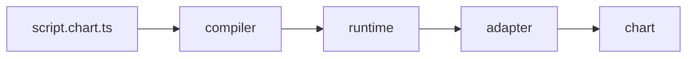

# chartlang

`chartlang` is an open-source TypeScript embedded DSL for writing
indicator, drawing, and alert scripts that run on any conforming
chart adapter. Authors write ordinary `.chart.ts` files using a small
set of primitives (`ta.*`, `plot`, `draw.*`, `alert`, `input.*`); a
compiler emits a sandboxable bundle; a runtime executes it bar-by-bar;
an adapter renders the emissions on a chart of the embedder's choice.
One script, many charts.

[](https://www.npmjs.com/package/@invinite-org/chartlang-core)
[](https://github.com/outraday-org/chartlang/actions/workflows/ci.yml)
[](https://codecov.io/gh/outraday-org/chartlang)
[](./LICENSE)

<!-- This script needs the Phase 1 runtime to actually execute; see
[`docs/getting-started/write-your-first-script.md`](./docs/getting-started/write-your-first-script.md). -->

```typescript
import { defineIndicator, ta, plot, color } from "@invinite-org/chartlang-core";

export default defineIndicator({ name: "ema-20" }, () => {
    const fastEma = ta.ema(series.close, 20);
    plot(fastEma, { color: color.purple });
});
```

## Install

Three install lines, one per role.

**Script author** — write `.chart.ts` indicators:

```bash
pnpm add @invinite-org/chartlang-core
```

**Adapter author** — build a new chart-vendor adapter:

```bash
pnpm add @invinite-org/chartlang-adapter-kit
```

**Embedder** — host the runtime inside a product:

```bash
pnpm add @invinite-org/chartlang-core @invinite-org/chartlang-compiler @invinite-org/chartlang-runtime @invinite-org/chartlang-host-worker
```

## Why chartlang

- **Open source, MIT-licensed, no chart-vendor lock-in.** The
  language, compiler, runtime, and adapter contract are all in this
  repo. No proprietary scripting dialect.
- **Portable across charts via the adapter contract.** One script runs
  on any conforming front-end — TradingView Lightweight Charts,
  Highcharts, ECharts, plain SVG, a bespoke WebGL renderer. Pick the
  chart, keep the script.
- **Sandboxable for server-side alert execution.** The QuickJS host
  runs the same compiled bundle inside a process-isolated sandbox, so
  alerts fire even when no browser is open.

## Quickstart in 60 seconds

> **Available from Phase 1.** The three commands below are aspirational
> for the bootstrap. See
> [`docs/getting-started/write-your-first-script.md`](./docs/getting-started/write-your-first-script.md)
> for the walkthrough as it lands.

```bash
pnpm dlx @invinite-org/chartlang-cli scaffold-script ema-cross
pnpm dlx @invinite-org/chartlang-cli compile ema-cross.chart.ts
pnpm dlx @invinite-org/chartlang-cli preview ema-cross.chart.ts --adapter canvas2d
```

The third command opens a rendered chart in your browser.

## Indicator parity

Phase 2 (`0.2`) ships full Pine-equivalent indicator parity:

- **90 callable `ta.*` primitives** in `TA_REGISTRY` — 9 Phase-1
  (`sma`, `ema`, `stdev`, `bb`, `rsi`, `macd`, `atr`, `crossover`,
  `crossunder`) plus 81 Phase-2 ports (6 cross-functional helpers +
  75 §9.2 indicators across MAs, oscillators, momentum, trend,
  volatility, volume, S/R, and statistical categories).
- **93 entries** in `STATEFUL_PRIMITIVES` (90 `ta.*` + `plot` +
  `hline` + `alert`) — `ta.nz` is the sole stateless `ta.*`.
- **6 new `PlotKind`s** (`histogram`, `bars`, `area`, `filled-band`,
  `label`, `marker`) plus canvas2d renderers.
- Universal `opts.offset` honoured on every primitive.
- `chartlang docs` regenerates `docs/primitives/ta/<id>.md` per
  primitive; `pnpm docs:gate` enforces no drift.
- `phase2Coverage.test.ts` pins the cardinalities; the
  `PHASE_2_INDICATORS` + `PHASE_5_DEFERRED` inventories are the
  source-of-truth surface contract.

Deferred to Phase 5: `correlationCoeff`, 4 volume-profile primitives
(need `horizontal-histogram` + viewport / anchor / session input
plumbing), and 7 trade-narrative external-data primitives (need
`input.externalSeries` + `adapter.feedExternalSeries`).

## Drawing parity

Phase 3 (`0.3`) ships full `draw.*` namespace parity with invinite:

- **61 callable `draw.*` primitives** across 13 categories: lines /
  rays, boxes (rectangle / circle / ellipse / marker), curves +
  freehand, annotations (text / arrow / arrow-marker), channels,
  Fibonacci (retracement / extension / channel / time-zone / wedge /
  speed-fan / speed-arcs / spiral / circles / trend-time), Gann,
  pitchforks, harmonic patterns (XABCD / cypher / head-and-shoulders /
  ABCD / triangle / three-drives), Elliott waves, cycles, and
  containers (group / frame).
- **154 entries** in `STATEFUL_PRIMITIVES` (93 Phase-2 + 61 new
  `draw.<kind>` entries; every drawing primitive is `slot: true`).
- **5-bucket `DrawingCounts` budget** (`{ lines, labels, boxes,
  polylines, other }`) with per-kind `bucketFor` map, per-bucket
  `drawing-budget-exceeded` enforcement, and per-kind capability
  gating via `Capabilities.drawings`.
- **`DrawingHandle.update(patch)` / `remove()`** with stable cross-bar
  ids keyed `slotId#subId`; emissions carry the FULL merged
  `DrawingState` so adapters get an idempotent rewrite.
- **`defineDrawing` constructor** for interactive drawing scripts —
  emits `ScriptManifest.kind: "drawing"` per PLAN.md §4.1.
- **76 conformance scenarios** (61 per-kind + 12 task bundles +
  `drawAll61` smoke + `drawBudgetOverflow` + `drawUnsupportedKind`).
  New `drawing-hash` assertion variant mirrors `plot-hash`.
- **Canvas2d reference adapter** renders every kind via 61
  `src/render/draw/<kind>.ts` files + shared helpers
  (`worldToCanvas`, `drawingDispatch`, `fibLevels`, `bezier`).
- **62 docs pages** auto-generated under `docs/primitives/draw/`
  (61 per-kind + 1 hand-written `index.md`); every `@example`
  block compiles through the `pnpm docs:check` gate.

Deferred to Phase 5: `draw.table` (CSS-pixel-positioned status
panels — needs the `TableCell` schema).

## Architecture



The compiler turns a `.chart.ts` script into a sandboxable bundle; the
runtime executes it bar-by-bar, producing typed emissions; the adapter
translates emissions into draw calls on a specific chart vendor's
surface. The contract between runtime and adapter is what makes scripts
portable across charts. See PLAN.md §2 for the full diagram.

## Links

- **Docs site:** [chartlang.dev](https://chartlang.dev) — placeholder
  until the VitePress build deploys in Phase 1+.
- **Language spec:** [`./docs/spec/grammar.md`](./docs/spec/grammar.md).
- **Primitive reference:** [`./docs/primitives/`](./docs/primitives/) —
  auto-generated per primitive. Phase-1 `ta.*` index at
  [`./docs/primitives/ta/`](./docs/primitives/ta/) (regenerate with
  `pnpm docs:generate`; CI gate: `pnpm docs:gate`).
- **Adapter list:** [`./docs/adapters/reference/`](./docs/adapters/reference/) —
  per-adapter pages published by consumer repos from Phase 2+.
- **Conformance reports:** the canvas2d-adapter ships its
  `CONFORMANCE.md` alongside the reference implementation in
  Phase 1. Forward-link only at the bootstrap.
- **Examples:** [`./examples/`](./examples/).
- **Contributing:** [`./CONTRIBUTING.md`](./CONTRIBUTING.md).
- **Code of conduct:** [`./CODE_OF_CONDUCT.md`](./CODE_OF_CONDUCT.md).
- **License:** [`./LICENSE`](./LICENSE) (MIT).
