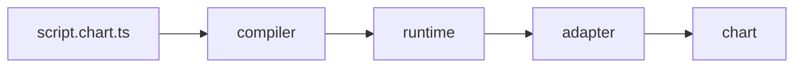

# chartlang

`chartlang` is an open-source TypeScript embedded DSL for writing
indicator, drawing, and alert scripts that run on any conforming
chart adapter. Authors write ordinary `.chart.ts` files using a small
set of primitives (`ta.*`, `plot`, `draw.*`, `alert`, `input.*`); a
compiler emits a sandboxable bundle; a runtime executes it bar-by-bar;
an adapter renders the emissions on a chart of the embedder's choice.
One script, many charts.

[](https://www.npmjs.com/package/@invinite-org/chartlang-core)
[](https://github.com/outraday-org/chartlang/actions/workflows/ci.yml)
[](https://codecov.io/gh/outraday-org/chartlang)
[](./LICENSE)

> Live at [chartlang.invinite.com](https://chartlang.invinite.com).
> Docs at [docs.chartlang.invinite.com](https://docs.chartlang.invinite.com).

```typescript
import { defineIndicator } from "@invinite-org/chartlang-core";

export default defineIndicator({
    name: "EMA Cross",
    apiVersion: 1,
    overlay: true,
    compute({ bar, ta, plot, alert }) {
        const fast = ta.ema(bar.close, 12);
        const slow = ta.ema(bar.close, 26);
        plot(fast, { color: "#26a69a", title: "EMA(12)" });
        plot(slow, { color: "#ef5350", title: "EMA(26)" });
        if (ta.crossover(fast, slow).current) {
            alert("EMA(12) crossed above EMA(26)", { severity: "info" });
        }
    },
});
```

## Try it

Three ways to exercise the full stack end-to-end:

- **Live demo** — open
  [chartlang.invinite.com](https://chartlang.invinite.com) in any
  browser. The landing page embeds a live editor + chart playground
  that compiles your script in a Netlify Function and renders it
  through the reference canvas2d adapter — nothing to install.
- **Run the site locally** — clone this repo and run the
  marketing + demo site against the workspace packages. See
  [Run the site locally](./docs/getting-started/run-the-site-locally.md):
  ```bash
  pnpm install && pnpm site:dev
  # then open http://localhost:3000
  ```
- **Vanilla canvas2d playground** — minimal HTML page that loads the
  pre-compiled `examples/scripts/ema-cross.chart.js` triple (build the
  workspace once with `pnpm install && pnpm build` first):
  ```bash
  pnpm dlx vite --port 5273
  # then open http://localhost:5273/examples/canvas2d-adapter/playground/
  ```

## Install

Three install lines, one per role.

**Script author** — write `.chart.ts` indicators:

```bash
pnpm add @invinite-org/chartlang-core
```

**Adapter author** — build a new chart-vendor adapter:

```bash
pnpm add @invinite-org/chartlang-adapter-kit
```

**Embedder** — host the runtime inside a product:

```bash
pnpm add @invinite-org/chartlang-core @invinite-org/chartlang-compiler @invinite-org/chartlang-runtime @invinite-org/chartlang-host-worker
```

## Why chartlang

- **TypeScript is the language — not a new dialect to learn.** Scripts
  are ordinary `.chart.ts` files with full type-checking, editor
  autocomplete, and refactoring out of the box. No bespoke grammar
  means LLMs already write it fluently, so authoring (and AI-assisted
  authoring) works on day one.
- **Open source, MIT-licensed, no chart-vendor lock-in.** The
  language, compiler, runtime, and adapter contract are all in this
  repo. No proprietary scripting dialect.
- **Portable across charts via the adapter contract.** One script runs
  on any conforming front-end — TradingView Lightweight Charts,
  Highcharts, ECharts, plain SVG, a bespoke WebGL renderer. Pick the
  chart, keep the script.
- **Sandboxable for server-side alert execution.** The QuickJS host
  runs the same compiled bundle inside a process-isolated sandbox, so
  alerts fire even when no browser is open.

## Quickstart

1. Write a script. Save the example above to `ema-cross.chart.ts`.
2. Compile it. The CLI emits a `.chart.js` bundle, a
   `.chart.manifest.json` capability descriptor, and a `.chart.d.ts`
   types sibling next to the source:
   ```bash
   pnpm dlx @invinite-org/chartlang-cli compile ema-cross.chart.ts
   ```
3. Render it. Drop the triple into the canvas2d playground above, or
   load it through `@invinite-org/chartlang-host-worker` inside your
   own chart. The
   [embed guide](./docs/getting-started/embed-in-our-chart.md) walks
   through the full wiring.

See
[`docs/getting-started/write-your-first-script.md`](./docs/getting-started/write-your-first-script.md)
for the long-form walkthrough.

## Architecture



The compiler turns a `.chart.ts` script into a sandboxable bundle; the
runtime executes it bar-by-bar, producing typed emissions; the adapter
translates emissions into draw calls on a specific chart vendor's
surface. The contract between runtime and adapter is what makes scripts
portable across charts.

## What's in the box

- **90 `ta.*` primitives** across moving averages, oscillators,
  momentum, trend, volatility, volume, support / resistance, and
  statistical helpers — full Pine-equivalent parity. See
  [`docs/primitives/ta/`](./docs/primitives/ta/) for the auto-generated
  per-primitive reference.
- **61 `draw.*` primitives** across lines, boxes, curves, Fibonacci
  tools, Gann tools, pitchforks, harmonic patterns, Elliott waves, and
  cycles. Each carries a `DrawingHandle` with stable cross-bar ids and
  idempotent `update` / `remove`. See
  [`docs/primitives/draw/`](./docs/primitives/draw/).
- **Alerts, inputs, multi-timeframe.** `alert(...)` with severity,
  twelve typed `input.*` shapes, `request.security` / `request.lowerTf`
  for higher- and lower-timeframe data, and `state.*` for cross-bar
  scalars. Capability-gated end-to-end so unsupported features become
  silent no-ops, not errors.
- **Three execution hosts.** An in-process runner, a browser Web
  Worker, and a server-side QuickJS sandbox — all returning
  byte-identical plot and alert streams (the
  [`parity-smoke.mts`](./parity-smoke.mts) script demonstrates).
- **220-scenario conformance suite.** `pnpm conformance` runs every
  adapter against the same battery of plot, drawing, alert, and
  budget-overflow scenarios. The
  [canvas2d reference adapter](./examples/canvas2d-adapter) ships a
  green `CONFORMANCE.md` you can diff against.
- **Compose indicators.** Bind one indicator to a `const`, read
  its outputs from another's `compute`. See
  [Indicator composition](./docs/language/indicator-composition.md).

## AI skills

Two installable [Agent Skills](https://www.skills.sh) teach an LLM to
work with chartlang — one for **writing** scripts, one for
**integrating** the stack:

```bash
npx skills add outraday-org/chartlang
```

See [`skills/`](./skills/) for both skills and manual-install steps.

## Releases

Versions are cut with Changesets. Pending changesets are collected into
the "Version Packages" PR; merging that PR publishes every
`@invinite-org/chartlang-*` package from CI with npm provenance.

Project release notes live in the root
[`CHANGELOG.md`](./CHANGELOG.md), with generated per-package changelogs
linked from there. Published announcements are on
[GitHub Releases](https://github.com/outraday-org/chartlang/releases).

## Links

- **Docs site:** [docs.chartlang.invinite.com](https://docs.chartlang.invinite.com)
  (deployed from `main` by Netlify).
- **Language overview:** [`./docs/language/overview.md`](./docs/language/overview.md).
- **Language spec:** [`./docs/spec/grammar.md`](./docs/spec/grammar.md).
- **Primitive reference:** [`./docs/primitives/`](./docs/primitives/) —
  auto-generated per primitive (regenerate with `pnpm docs:generate`;
  CI gate: `pnpm docs:gate`).
- **Adapter author guide:** [`./docs/adapters/writing-an-adapter.md`](./docs/adapters/writing-an-adapter.md).
- **Host author guide:** [`./docs/hosts/writing-a-host.md`](./docs/hosts/writing-a-host.md).
- **Examples:** [`./examples/`](./examples/).
- **Contributing:** [`./CONTRIBUTING.md`](./CONTRIBUTING.md).
- **Code of conduct:** [`./CODE_OF_CONDUCT.md`](./CODE_OF_CONDUCT.md).
- **License:** [`./LICENSE`](./LICENSE) (MIT).
