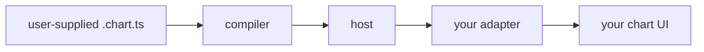

# Embed in your chart

Run user-supplied chartlang scripts inside an existing chart UI. The
embed is three layers — compile, host, adapter — wired through a pair
of typed JSON-safe boundaries.



The compiler runs server-side (it needs node and native esbuild). The
host runs wherever you want isolation — a Web Worker in the browser, a
QuickJS-WASM sandbox on a server. The adapter is the bridge to your
existing chart library.

## Compile server-side

The compiler imports node builtins (`fs`, `crypto`, `path`) and a
native esbuild launcher, so it does not bundle for the browser. Run it
under node — typically inside a small HTTP endpoint your editor calls:

```ts no-gate
import { compile, CompileError } from "@invinite-org/chartlang-compiler";

export async function compileScript(
    source: string,
): Promise<{ moduleSource: string; manifest: unknown } | { errors: unknown[] }> {
    try {
        const result = await compile(source, {
            apiVersion: 1,
            sourcePath: "user-script.chart.ts",
        });
        return { moduleSource: result.moduleSource, manifest: result.manifest };
    } catch (err) {
        if (err instanceof CompileError) return { errors: [...err.diagnostics] };
        throw err;
    }
}
```

`examples/react-demo/server/compilePlugin.ts` shows the same pattern as
a Vite dev-server middleware — call it from a `POST /api/compile`
endpoint, ship the response to the browser editor.

## Host the bundle

The compiled `moduleSource` is a self-contained ESM string with an
`export const __manifest = ...;` tail. Pick a host based on where you
want execution to live:

- `@invinite-org/chartlang-host-worker` — Web Worker isolation in the
  browser. Loads the bundle via a `data:` URL so a single code path
  works in production browsers and node test environments.
- `@invinite-org/chartlang-host-quickjs` — QuickJS-WASM sandbox.
  Process-isolated, with real CPU preemption + hard heap caps. Ideal
  for server-side alert execution when no browser is open.

Both hosts expose the same `ScriptHost` shape, so swapping is a
one-line change:

```ts no-gate
import { createWorkerHost } from "@invinite-org/chartlang-host-worker";
import type { Capabilities, ScriptManifest } from "@invinite-org/chartlang-adapter-kit";

declare const myCapabilities: Capabilities;
declare const moduleSource: string;
declare const manifest: ScriptManifest;

const host = createWorkerHost({ capabilities: myCapabilities });
await host.load({ moduleSource, manifest });
// later: host.push({ kind: "close", bar }); host.drain(); host.dispose();
```

The Worker host accepts a `workerLike` injection seam so tests can
drive it through a `MessageChannel` (the
[`parity-smoke.mts`](https://github.com/outraday-org/chartlang/blob/main/parity-smoke.mts)
script demonstrates).

## Render through an adapter

`@invinite-org/chartlang-adapter-kit` defines the contract; you bring
the renderer. The reference adapter under
[`examples/canvas2d-adapter/`](https://github.com/outraday-org/chartlang/tree/main/examples/canvas2d-adapter)
shows the full flow — `createCanvas2dAdapter` constructs a handle that
wraps a host, a candle source, and a renderer; `runRendererLoop`
pumps candles through the host and drains emissions onto a canvas:

```ts no-gate
import { mockCandleSource } from "@invinite-org/chartlang-adapter-kit";
import type { Bar, ScriptManifest } from "@invinite-org/chartlang-core";
import {
    createCanvas2dAdapter,
    runRendererLoop,
} from "chartlang-example-canvas2d-adapter";

declare const canvas: HTMLCanvasElement;
declare const bars: ReadonlyArray<Bar>;
declare const moduleSource: string;
declare const manifest: ScriptManifest;

const controller = new AbortController();
const adapter = createCanvas2dAdapter({
    canvas,
    candleSource: mockCandleSource(bars, { interval: "1D", mode: "stream" }),
});
await adapter.host.load({ moduleSource, manifest });
await runRendererLoop(adapter, { signal: controller.signal });
// later: controller.abort(); adapter.dispose();
```

`examples/react-demo/src/ChartPane.tsx` shows the React-flavoured
version of the same pattern — every new compile disposes the previous
adapter and spins up a fresh one against the same canvas.

## Sandboxing

The execution sandbox is the runtime's first guarantee. Scripts cannot
reach `Math.random`, `Date`, `fetch`, `setTimeout`, or the DOM — the
compiler rejects every hostile global through `forbiddenConstructs`
before the bundle is built, and the host re-validates every emission
on `drain()` as defence-in-depth.

Per-script limits are set on the host:

- **Worker host** — CPU watchdog is measurement-only (the browser
  cannot preempt a Worker mid-step). A `step-overshoot` warning
  surfaces through the optional `onWorkerError` callback when a single
  compute step exceeds the configured budget.
- **QuickJS host** — real CPU preemption and a hard heap cap. A
  runaway script aborts cleanly without taking the host process with
  it. This is the host to run on a server.

Both hosts return byte-identical plot and alert streams for the same
input — the
[`parity-smoke.mts`](https://github.com/outraday-org/chartlang/blob/main/parity-smoke.mts)
script in the repo root runs the EMA-cross example through all three
execution paths (in-process runner, Worker host, QuickJS host) and
asserts identical output.

## Browser bundling rough edges

The compiler and the language service both transitively import node
builtins (`fs/promises`, `path`, `url`, `crypto`, `os`) and a native
esbuild launcher. The
[`examples/react-demo/vite.config.ts`](https://github.com/outraday-org/chartlang/blob/main/examples/react-demo/vite.config.ts)
file shows the alias pattern that lets the language service load in
the browser for hover / completion while the real `compile()` runs
server-side over `/api/compile`:

```ts no-gate
import { fileURLToPath } from "node:url";
import { defineConfig } from "vite";

export default defineConfig({
    resolve: {
        alias: [
            { find: "esbuild", replacement: "./src/esbuildStub.ts" },
            { find: /^node:(crypto|fs\/promises|path|url|os)$/, replacement: "./src/nodeBuiltinStub.ts" },
        ],
    },
    optimizeDeps: { exclude: ["esbuild"] },
});
```

The stubs return enough surface for module-load to succeed; any
attempt to actually call into them fails fast. The server-side
`compile()` runs in node and reaches the real implementations through
Vite's plugin layer, which does not pass through these aliases.

## Next steps

- [Hosts/Worker](../hosts/worker.md) — the Worker host's limits API,
  the postMessage protocol, the `step-overshoot` contract.
- [Hosts/QuickJS](../hosts/quickjs.md) — the QuickJS host's heap
  cap, real preemption, and the WASM module flow.
- [Adapter contract](../adapters/contract.md) — the type-level
  reference for every emission shape your `onEmissions` will see.
- [Spec/Emissions](../spec/emissions.md) — the canonical wire shape
  for every payload moving through the boundaries above.
