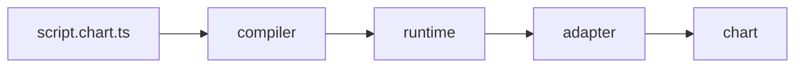

# chartlang

An open, portable scripting language for technical analysis. Write an
indicator once as a `.chart.ts` script; the compiler emits a sandboxed
artifact that runs unchanged on any conformant chart adapter. The
runtime, primitives, and adapter contract are versioned and conformance-
tested so a script written today still works on a chart built tomorrow.

## Get started

- [Write your first script](./getting-started/write-your-first-script.md)
- [Write your first adapter](./getting-started/write-your-first-adapter.md)
- [Embed in a chart](./getting-started/embed-in-our-chart.md)

## Architecture

Each arrow is a typed, JSON-friendly boundary that survives
`structuredClone` so the same payload moves through a Worker `postMessage`
or a QuickJS-WASM membrane unchanged. See PLAN.md §2 for the full
diagram including the sandbox-host layer.

## Explore

- [Language](./language/overview.md) — the eDSL surface, series, inputs,
  alerts, version pinning, forbidden constructs.
- [Primitives](./primitives/) — auto-generated reference for `ta.*`,
  `plot.*`, `draw.*`, `alert.*`, `input.*` (lands per primitive in
  Phase 1+).
- [Adapters](./adapters/contract.md) — adapter contract, capabilities,
  authoring guide, conformance suite.
- [Hosts](./hosts/worker.md) — worker host, QuickJS host, host-author
  guide.
- [Spec](./spec/grammar.md) — canonical grammar, semantics, manifest,
  emissions, `apiVersion` contract.
- [Reference](./reference/glossary.md) — glossary and FAQ.

> Stubbed during the Phase 0 bootstrap (PLAN.md §17.1 / §22). Real
> content lands as each phase ships.
