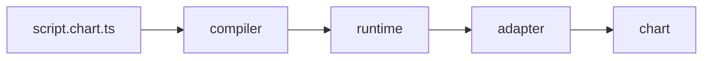

# chartlang

An open, portable scripting language for technical analysis. Write an
indicator once as a `.chart.ts` script; the compiler emits a sandboxed
artifact that runs unchanged on any conformant chart adapter. The
runtime, primitives, and adapter contract are versioned and
conformance-tested so a script written today still works on a chart
built tomorrow.

```ts
import { defineIndicator } from "@invinite-org/chartlang-core";

export default defineIndicator({
    name: "EMA Cross",
    apiVersion: 1,
    overlay: true,
    compute({ bar, ta, plot, alert }) {
        const fast = ta.ema(bar.close, 12);
        const slow = ta.ema(bar.close, 26);
        plot(fast, { color: "#26a69a", title: "EMA(12)" });
        plot(slow, { color: "#ef5350", title: "EMA(26)" });
        if (ta.crossover(fast, slow).current) {
            alert("EMA(12) crossed above EMA(26)", { severity: "info" });
        }
    },
});
```

## Get started

- [Write your first script](./getting-started/write-your-first-script.md)
  — install core, write an EMA-cross indicator, compile and render it.
- [Start from a working app](./getting-started/react-starter.md) —
  `npm create chartlang@latest my-app` scaffolds a full editor + live
  chart starter with the chart library you pick.
- [Embed in your chart](./getting-started/embed-in-our-chart.md) —
  wire the compiler, host, and adapter into an existing chart UI.
- [Write your first adapter](./getting-started/write-your-first-adapter.md)
  — scaffold an adapter and validate it against the conformance suite.

## Architecture



Each arrow is a typed, JSON-friendly boundary that survives
`structuredClone` so the same payload moves through a Worker
`postMessage` or a QuickJS-WASM membrane unchanged.

## Explore

- [Language](./language/overview.md) — the eDSL surface, series,
  inputs, alerts, version pinning, forbidden constructs.
- [Primitives](./primitives/ta/) — auto-generated reference for
  `ta.*`, `plot`, `draw.*`, `alert`, `input.*`, `state.*`,
  `request.*`.
- [Adapters](./adapters/contract.md) — adapter contract, capabilities,
  authoring guide, conformance suite.
- [Hosts](./hosts/worker.md) — Worker host, QuickJS host, host-author
  guide.
- [Spec](./spec/grammar.md) — canonical grammar, semantics, manifest,
  emissions, `apiVersion` contract.
- [Reference](./reference/glossary.md) — glossary and FAQ.
