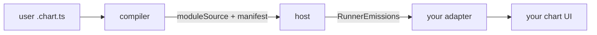

# chartlang-setup

You are integrating chartlang into a product. chartlang is an
open-source TypeScript embedded DSL: authors write `.chart.ts` scripts,
a compiler emits a sandboxable bundle, a host runs that bundle
bar-by-bar, and an adapter renders the host's emissions on whatever
chart vendor the product uses. This skill wires those four pieces
together. To *write* the scripts themselves, use the `chartlang-coding`
skill instead.

The deep snippets live in the references — route by what you are doing:

- [`references/embed.md`](./references/embed.md) — compile a script,
  host the bundle, render through an adapter (the full embed path).
- [`references/adapter.md`](./references/adapter.md) — author a new
  chart-vendor adapter against the `adapter-kit` contract + conformance.
- [`references/server-alerts.md`](./references/server-alerts.md) — fire
  alerts headless on a server with the QuickJS host.

## 1. The three boundaries



A script becomes a **bundle** in the compiler — this runs *server-side*:
the compiler imports node builtins (`fs`, `crypto`, `path`) and a native
esbuild launcher, so it does not bundle for the browser. The bundle runs
in a **host** — a Web Worker for browser isolation, or a QuickJS-WASM
sandbox for server isolation. The host's per-bar **emissions** render
through an **adapter** you supply for your chart library. Two typed,
JSON-safe boundaries carry data: compiler→host (`{ moduleSource,
manifest }`) and host→adapter (`RunnerEmissions`). Everything crossing
either boundary is JSON-cloneable by construction.

The host runs the bundle through a fixed lifecycle: `load({ moduleSource,
manifest })` once, then per bar `await host.push({ kind: "close", bar })`
followed by `await host.drain()` to collect that bar's emissions, and
`host.dispose()` at teardown. Pick the host by where execution should
live:

| Host | Isolation | Reach for it when |
|---|---|---|
| `-host-worker` | Web Worker (browser) | Trusted scripts, browser embed, lightest path. CPU watchdog is measurement-only. |
| `-host-quickjs` | QuickJS-WASM sandbox | Untrusted scripts or server-side alerts. Real CPU preemption + hard heap cap. |

Both expose the same `ScriptHost` shape, so the choice is a one-line
constructor swap (see § 5).

## 2. Pick your path

| If you want to… | Read | Package(s) |
|---|---|---|
| Run user scripts inside an existing chart UI | [`references/embed.md`](./references/embed.md) | `-compiler`, `-host-worker`, `-adapter-kit` |
| Render chartlang on a new chart vendor | [`references/adapter.md`](./references/adapter.md) | `-adapter-kit` |
| Fire alerts server-side with no browser | [`references/server-alerts.md`](./references/server-alerts.md) | `-compiler`, `-host-quickjs` |

## 3. Install

Install only the packages your role needs. The compiler is **node-only**
(native esbuild) and must run server-side; the host and adapter run
wherever you want isolation — browser, node, or both.

```bash
# Embedder — compile server-side, host in the browser, render via adapter
pnpm add @invinite-org/chartlang-compiler \
         @invinite-org/chartlang-host-worker \
         @invinite-org/chartlang-adapter-kit

# Adapter author — build a chart-vendor adapter
pnpm add @invinite-org/chartlang-adapter-kit

# Server alerts — compile + run headless in a QuickJS sandbox
pnpm add @invinite-org/chartlang-compiler \
         @invinite-org/chartlang-host-quickjs \
         @invinite-org/chartlang-adapter-kit
```

`compile()` reaches node builtins and native esbuild — never ship it to
the browser. The reference embed (`apps/site/`) runs `compile` behind a
`POST /api/compile` **Netlify Function** (a TanStack Start server route,
not a Vite dev middleware) and stubs the language service's node imports
for in-browser hover/completion; see `embed.md`.

## 4. Capability gating (cross-cutting)

The runtime queries the adapter's `Capabilities` before it emits.
**Anything the adapter does not advertise becomes a silent no-op, not an
error** — a script that emits an unsupported plot kind, drawing kind, or
alert kind drops the emission and logs a diagnostic instead of crashing
the renderer. So two declarations meet at runtime: the adapter advertises
what it *supports* (`Capabilities`), and the compiled `manifest` declares
what a script *needs* (extracted from the script's imports). See
[`docs/spec/manifest.md`](https://github.com/outraday-org/chartlang/blob/main/docs/spec/manifest.md)
for the manifest shape and `adapter.md` for declaring capabilities
honestly.

## 5. Host parity guarantee

The in-process runner, the Worker host, and the QuickJS host return
**byte-identical** plot and alert streams for the same input. Both
`ScriptHost` implementations expose the same shape
(`load` / `push` / `drain` / `dispose` / `limits`), so swapping a
browser Worker for a server-side QuickJS sandbox is a one-line change.
Parity is the conformance contract — the conformance suite runs every
fixture through both hosts and asserts identical drained emissions, and
[`parity-smoke.mts`](https://github.com/outraday-org/chartlang/blob/main/parity-smoke.mts)
in the repo root runs the EMA-cross example through all three execution
paths and asserts they match. If QuickJS needs a host-specific sandbox
rule it surfaces it through the error channel, never through a different
emission shape.
